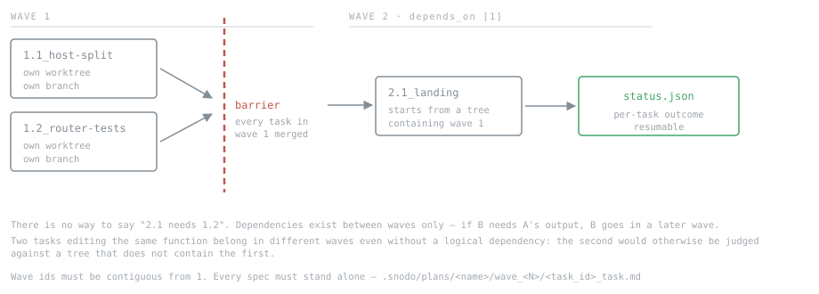

# Authoring a snodo plan

A contract for whatever writes plans — a human, or an orchestrator model asked
to break a specification into executable work. It describes exactly what snodo
accepts, what it refuses, and why.

snodo does not generate plans. `snodo plan create` writes an empty scaffold;
everything below is authored.

---

## 1. The one modelling rule

**Dependencies are between waves, not between tasks.**

Every task in a wave may run in any order, and a wave is only entered once
every wave it depends on has *completely* finished. There is no way to say
"task 2.2 needs task 2.1". If B needs A's output, B goes in a later wave.

So the question for each task is not "what does this depend on?" but **"what
must already be true in the repository before this task starts?"** Everything
sharing an answer belongs in the same wave.

A wave is a barrier, not a bucket. Two tasks that both edit the same function
belong in different waves even if neither logically depends on the other,
because they will otherwise both start from the same base and the second will
be reviewed against a tree that does not contain the first.

Ordering is expressed only by waves: when one task needs another's output, put
it in a later wave. Tasks that touch the same code also belong in separate
waves, even if neither depends on the other, to avoid overlapping work.

By default, put several small, independently useful tasks in each wave. Add
waves only when ordering or overlapping code demands it.

---



---

## 2. Layout

```
.snodo/plans/<plan-name>/
  plan.yml
  status.json
  wave_1/
    1.1_host-split_task.md
    1.2_router-tests_task.md
  wave_2/
    2.1_landing_task.md
```

Directory is `wave_<N>` where N is the wave id. Spec file is
`<task_id>_task.md` — the task id verbatim, then `_task.md`.

### `plan.yml`

```yaml
name: w2
intent: >
  Split the app onto its own host and put marketing on the freed www root.
waves:
  - id: 1
    depends_on: []
    tasks:
      - "1.1_host-split"
      - "1.2_router-tests"
  - id: 2
    depends_on: [1]
    tasks:
      - "2.1_landing"
```

- `name` — matches the directory name.
- `intent` — one or two sentences. What the whole plan is for. Not a summary
  of the tasks.
- `waves[].id` — an integer. Wave ids must be contiguous from 1: `1, 2, 3`.
  A plan with waves `1, 3` is refused.
- `waves[].depends_on` — integer wave ids that must be complete first. May be
  empty. May not name a wave that does not exist, and may not form a cycle.
- `waves[].tasks` — task ids, as strings.

### `status.json`

```json
{ "tasks": {} }
```

That is the whole file for a new plan. snodo fills it in as tasks run, giving
each an entry of `{status, parent_task_ref, depth, spec_hash}` where status is
one of `pending`, `in_progress`, `completed`, `blocked`, `errored`. A blocked
task has a task-level failure and is retried with that failure as context. An
errored task means the runner hit an operational or internal fault instead of
receiving a task result; it is not retried, because passing that fault to a
faultless coder as critique could cause a sound specification to be rewritten
to chase a problem it did not cause. Do not pre-populate it — an entry naming a
task that no wave lists is an error.

### Task ids

Must match `^\d+\.\d+_[A-Za-z0-9_-]+$` — wave number, dot, sequence number,
underscore, a name of letters, digits, hyphens and underscores.

```
1.1_host-split      ok
2.1_landing         ok
1.1_host split      no — space
1_host-split        no — no sequence number
w1.1_host-split     no — wave must be a bare integer
```

The leading number **must** equal the wave the task is listed in. `2.1_landing`
in wave 1 puts its spec file in the wrong directory and the plan will not
validate.

---

## 3. What goes in a task spec

Each `*_task.md` is the complete instruction for one run of the protocol loop.
It is read verbatim as the task specification — the same string you would pass
to `snodo run "..."`. Nothing else is injected. The task cannot see the plan,
the other tasks, or the intent.

**Write every spec as if it is the only thing the reader will ever see.** If
wave 2 depends on wave 1, wave 2's spec must describe the state of the
repository *after* wave 1, in its own words. Never write "as established in
task 1.1".

The structure that works, in this order:

**INTENT** — what becomes true, in the product's terms. Name the files and
functions involved, and say what is already correct so the reader does not
re-do it. Point at the authoritative records (ADRs, design files) by path, and
state that where the spec and the record disagree, the record wins.

**THE CHAIN** — the numbered links of states that must all be true for the task
to be done. Each link names a file and the state that must be true in it when
the task is done; describe the outcome, not the code to write. For example,
`src/cart/total.ts` — an empty cart reports a total of zero is a good link.
“Return 0 when `items.length` is 0” prescribes the solution. Name every file
the task will change so possible same-wave file overlap can be detected at plan
time. The last link is usually a test.

**CONSTRAINTS** — what must not change, and the invariants that survive. Say
the reason, not just the rule; a reviewer that knows why can catch a violation
you did not anticipate. Explicitly list files that are out of scope.

**ACCEPTANCE** — the specific tests that must exist and pass. Concrete enough
that their absence is unambiguous.

**Do not put a mode on a task.** Modes are a protocol concept; the plan does
not choose them. A plan runs under one protocol, and the mode is whatever the
protocol's current mode is. If two tasks genuinely need different modes, they
are two plans.

---

## 4. What gets the plan refused

`snodo plan validate <name>` runs before wave 1 dispatches anything, so a
malformed plan fails before any work happens rather than in the middle.

Errors — the plan will not run:

| message | cause |
|---|---|
| `Missing intent` | `intent` absent or empty |
| `No waves defined` | `waves` empty |
| `Wave-number gap detected: expected contiguous 1..N` | wave ids are not `1..N` |
| `Wave id '<v>' is not an integer` | a non-integer wave id |
| `Wave N depends on unknown wave M` | `depends_on` names a wave that does not exist |
| `Wave dependency cycle detected involving wave N` | waves depend on each other in a loop |
| `Status entry '<id>' has no matching task in plan waves` | `status.json` names a task no wave lists |
| `Task '<id>' references unknown parent_task_ref '<ref>'` | bad `parent_task_ref` |
| `Parent reference cycle detected involving task '<id>'` | parent chain loops |
| `Missing spec: <task_id>` | no `wave_<N>/<task_id>_task.md` on disk |

Warnings — the plan runs, but say so deliberately:

| message | cause |
|---|---|
| `Wave N has no tasks` | an empty wave |

`Missing spec` is the common authoring mistake: a task listed in `plan.yml`
whose file was never written, or was written under a name that does not match
the id exactly.

---

## 5. Running it

```bash
snodo plan validate w2            # check before running anything
snodo plan run w2                 # or: snodo run --plan w2
snodo plan run w2 --wave 2        # one wave only
snodo plan run w2 --interactive   # confirm each task
snodo plan status w2              # per-wave progress
```

Execution walks waves in order. A wave whose dependencies are not all
`completed` is skipped and reported as blocked. Within a wave, each task goes
through the full protocol loop — the same validators, halt taxonomy and
`snodo authorize` path as a single `snodo run`.

A task that halts is marked `blocked` and the run stops. Re-running the plan
resumes: completed tasks are skipped, and a blocked task with failure context
is retried through the retry path rather than started over. Adjudicate a halt
with `snodo authorize <task_id>` first, then re-run the plan.

---

## 6. A worked example

`~/.snodo/specs/w2-d1-host-split.txt` and `w2-d2-landing.txt`, currently run by
hand back to back, as a plan. The second defers to the first — *"The marketing
page that will occupy the freed www root is a separate task"* — which is a
dependency between waves.

```
.snodo/plans/w2/
  plan.yml
  status.json
  wave_1/1.1_host-split_task.md      ← w2-d1-host-split.txt, verbatim
  wave_2/2.1_landing_task.md         ← w2-d2-landing.txt, verbatim
```

```yaml
name: w2
intent: >
  Move the app to its own host and put the marketing page on the freed www
  root, without changing where a card answers.
waves:
  - id: 1
    depends_on: []
    tasks: ["1.1_host-split"]
  - id: 2
    depends_on: [1]
    tasks: ["2.1_landing"]
```

```json
{ "tasks": {} }
```

```bash
snodo plan validate w2 && snodo plan run w2
```

Wave 2 cannot start until wave 1 completes, and if `2.1_landing_task.md` is
missing the whole plan refuses before wave 1 runs — rather than doing the
hosting split and then discovering the second half was never written.

---

## 7. Checklist for an orchestrator

- [ ] Every task's wave number matches the wave listing it.
- [ ] Wave ids are contiguous from 1.
- [ ] Anything needing another task's output is in a later wave.
- [ ] Two tasks touching the same code are in different waves.
- [ ] Every task id has a spec file at `wave_<N>/<task_id>_task.md`.
- [ ] Every spec stands alone — no reference to other tasks by id.
- [ ] Every spec names its authoritative records by path.
- [ ] Every spec has an ACCEPTANCE section naming specific tests.
- [ ] No spec mentions a mode.
- [ ] `status.json` is `{"tasks": {}}`.
- [ ] `snodo plan validate <name>` passes.

---

## 8. The planning loop, end to end

### Write the intent

Start with the outcome the whole plan should produce, in product terms. Keep
the intent to one or two sentences; it is not a task list. `propose_plan`
creates an inert plan scaffold from that intent. `decompose` creates a scaffold
with the requested number of empty wave slots; it does not invent or populate
the task breakdown. The orchestrator decides what work is needed and fills in
the waves and tasks.

### Break the work into waves of small tasks

First ask what must already be true before each piece of work can start. Put
tasks with the same prerequisite state in one wave; when one task needs
another's output, put it in a later wave. Tasks in one wave are unordered and
may run concurrently.

A wave should usually hold several small, independently useful tasks. One task
per wave is a common sizing mistake: it adds barriers without enabling useful
parallel work. But splitting one fat task into two fat tasks does not fix the
problem. Each task should have a narrow outcome, bounded scope, and its own
clear acceptance check. If two tasks may edit the same code, separate them into
different waves even if they look logically independent.

### Write each spec

Use `generate_spec` for each task id in the plan. Specs are standalone: include
the expected repository state, authoritative records, constraints, and concrete
acceptance checks in the spec itself. Lead with **intention**—what should
become true—not a proposed implementation. Describe the symptom and evidence
that establish the need, and cite the relevant files by path. Do not prescribe
the fix or dictate edits. Quoted evidence is useful context, not a prescription:
explain what it demonstrates, then leave the solution to the task runner.

### Validate and review the human gate

Call `validate_plan` after the plan and all specs are written. It reports
structural errors that refuse execution, along with plan-time checks from
`compiler/verifier.py`'s `verify_plan`:

- **`Missing referenced path in spec`** is an error. The spec cites a path that
  does not exist in the repository or is not created by this or an earlier
  task. Correct the path, describe a genuinely new path as something the task
  will create, or arrange for an earlier wave to create it.
- **`Possible same-wave file overlap`** is a warning, not a refusal. It means
  two same-wave specs cite the same path; citations are only a proxy for files
  either task will actually change. Review whether the tasks could conflict. If
  so, split or reorder them into separate waves; otherwise, keep the wave
  intentionally parallel. Name every file a task will change in its spec so
  those citations can reveal possible overlap before dispatch.

Read the validation result and the complete proposed plan, including every
spec. Validation is the human gate, not a substitute for reviewing whether the
intent, sizing, ordering, and instructions are sound. Resolve refusals and make
an explicit decision about each warning before dispatch.

### Dispatch

Once reviewed, call `run_plan`. It starts an asynchronous job and returns a
`job_id` immediately; that response confirms that the run was queued, not that
the plan ran or succeeded.

### Listen to the run

Poll the plan-run job with `get_job_status` until it has a terminal status. Use
`list_jobs` to find child jobs: each child carries the plan-run id in
`parent_job`. Pair each child's `task_ref` with the task id in the plan, and use
`get_plan` for the plan's per-task and per-wave state. Do not stop at the
parent's starter response or assume the plan is done because dispatch returned.
Terminal job statuses are `completed`, `failed`, `cancelled`, and `unmerged`;
stop polling once the parent job reaches one of them. Use `get_job_logs` on
jobs that need diagnosis.

### Read the outcome

After the parent job is terminal, inspect `get_plan` and the child job results
to see which tasks completed and whether any are blocked, errored, or unmerged.
Confirm success from the recorded outcomes, not from the fact that `run_plan`
returned. If work did not complete, use the task and job details to decide what
to fix or resolve before running the plan again.
