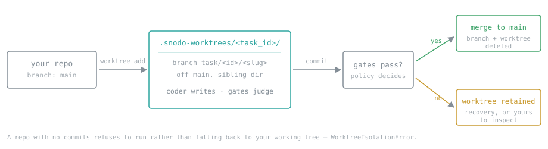
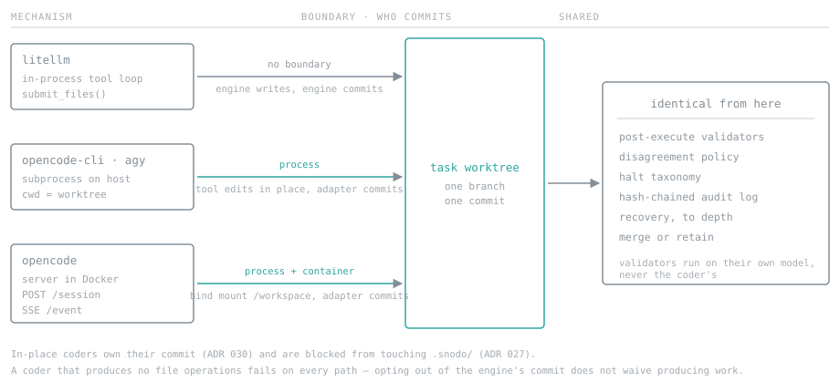

# Coder Backends

snodo executes protocol tasks under interchangeable code generation backends (**coders**). The coder generates code, while snodo enforces protocol governance, runs validation gates, and maintains an append-only audit log.



*Isolation comes first and is not the coder's business. A task never runs in your
working tree unless you ask for that with `--no-isolation`.*



*All three write into that same worktree. What differs is which process boundary
the write crosses and who makes the commit — everything after is identical.*

## Supported and External Coders

| Coder (`--coder`) | Description | Type | Requirements | Authentication |
|---|---|---|---|---|
| `litellm` *(default)* | Direct LLM completions via LiteLLM (~100+ providers) | Engine-Managed | Python `litellm` (built-in) | Provider API keys for the **validators**, which always run through LiteLLM (`OPENAI_API_KEY`, `ANTHROPIC_API_KEY`, etc. or `snodo config add`) |
| `opencode` | OpenCode server running in Docker container over HTTP | In-Place Container | Docker daemon running; image `opencode:latest` | OpenCode config/env variables inside container |
| `opencode-cli` | Host `opencode run` CLI invocation | In-Place Host CLI | `opencode` CLI on PATH | `opencode auth login` or host provider env vars (`OPENROUTER_API_KEY`, etc.) — the coder authenticates against your own subscription |
| `agy` | Antigravity CLI (`agy -p`) host invocation | In-Place Host CLI | `agy` CLI on PATH | `agy login` / Google Cloud host credentials — the coder authenticates against your own subscription |
| `mock` | Deterministic stub for dry-runs and testing | Stub | None | None |

### Authentication: keys are for the validators

Provider API keys are a requirement of the **validators**, which always run
through LiteLLM — not of the coder. The coder need not use one: `opencode-cli`
and `agy` authenticate against the operator's own subscription, so no provider
key is spent on writing the code. `--mock` needs nothing at all.

Beyond the built-in catalog (Anthropic, OpenAI, Google, OpenRouter, DeepSeek and
Cloudflare Workers AI), any OpenAI-compatible endpoint works by declaring a
provider block with `base_url` and `litellm_provider: openai` — that is the
mechanism, and it covers Ollama Cloud, a local Ollama or `llama.cpp` server,
vLLM, LM Studio, and self-hosted gateways. A local endpoint that needs no key is
not asked for one.

## Model Role Separation: Judging vs Execution

- **`-m` / `--model` sets the JUDGING model**: The model passed via `-m` (e.g. `-m claude-3-5-sonnet` or `-m deepseek/deepseek-v4`) is resolved through LiteLLM for **validators** (pre-execute and post-execute gates) and the **classifier** (intent routing).
- **External CLI coders use their own model catalogs**: Host CLI tools like `agy` or `opencode-cli` maintain their own internal model catalogs and CLI settings. Passing a judging model identifier to an external CLI coder is omitted so the CLI falls back to its own default/last-selected model.
- **Explicit Coder Model Override**: To specify a coder's model explicitly while keeping `-m` for validators, prefix the model string with the coder's namespace:
  ```bash
  snodo run "implement feature" --coder agy --model agy/gemini-2.5-pro
  snodo run "implement feature" --coder opencode-cli --model opencode-cli/claude-3-7-sonnet
  ```

## Coder Selection Precedence

`resolve_coder_name()` selects the active coder by evaluating criteria in strict order:

1. **Explicit Mock Flag**: `--mock` / `use_mock_coder=True` (always returns `'mock'`).
2. **Explicit CLI Flag**: `--coder <name>` (e.g., `snodo run "task" --coder agy`).
3. **Protocol Mode Field**: `coder: <name>` declared in a mode definition in `.snodo/protocol.yml` (`modes[].coder`).
4. **Model Prefix Mapping**: Inferred from model prefix: `opencode-cli/` → `opencode-cli`, `opencode/` → `opencode`, `agy/` → `agy`, `gpt`/`o1`/`o3` → `openai`, `claude` → `anthropic`, `gemini`/`google/` → `gemini`.
5. **Default Fallback**: `'litellm'`.

## In-Place Coders vs `litellm`

External coders (`opencode`, `opencode-cli`, `agy`) inherit `InPlaceCoderAdapter` (`skip_engine_commit = True`, `skip_workspace_write = True`):

- **In-Place File Writes**: External coders edit files directly in the workspace working tree.
- **Commit Ownership**: The adapter stages and commits changes to git upon completion (`InPlaceCoderAdapter._commit_changes()`), advancing `HEAD` so post-execute validators reviewing `git diff HEAD~1..HEAD` see the exact change produced.
- **`.snodo/` Mutation Guard**: Any attempt by an in-place coder to modify the `.snodo/` directory triggers a `SnodoMutationError` and halts execution as a `snodo_mutation_blocked` blocker (ADR 027).
- **No Per-Turn Usage or Token Records**: Per **ADR 034**, the absence of turn-by-turn usage and token metrics for external coders is a **stated decision (non-goal)**, not an attestation gap. Token and cost data reside in per-job operational telemetry (`state.json` via `snodo meta`), whereas snodo's hash-chained audit trail attests to governance decisions and verification evidence across all coders.

## Adding a New Coder Adapter

New host CLI coder adapters inherit `SubprocessCoderAdapter` (`snodo.coders.subprocess_adapter`), which provides shared subprocess execution, prompt construction, git diff readback, and artifact construction.

Creating a new CLI adapter requires specifying four class attributes and implementing `_build_argv`:

```python
from typing import List
from snodo.coders.subprocess_adapter import SubprocessCoderAdapter

class CustomCoderAdapter(SubprocessCoderAdapter):
    binary: str = "custom-coder"
    model_prefix: str = "custom/"
    install_hint: str = "Install custom-coder: https://example.com/install"

    def _build_argv(self, prompt: str, project_root: str, model: str) -> List[str]:
        argv = [self.binary, "run", "--dir", project_root, prompt]
        if model:
            argv.extend(["--model", model])
        return argv
```

Registering the adapter class in `CODER_REGISTRY` (`snodo/coders/__init__.py`) automatically exposes it to `--coder`, enables model prefix routing, and includes it in the adapter conformance test suite (`tests/coders/test_adapter_conformance.py`).
